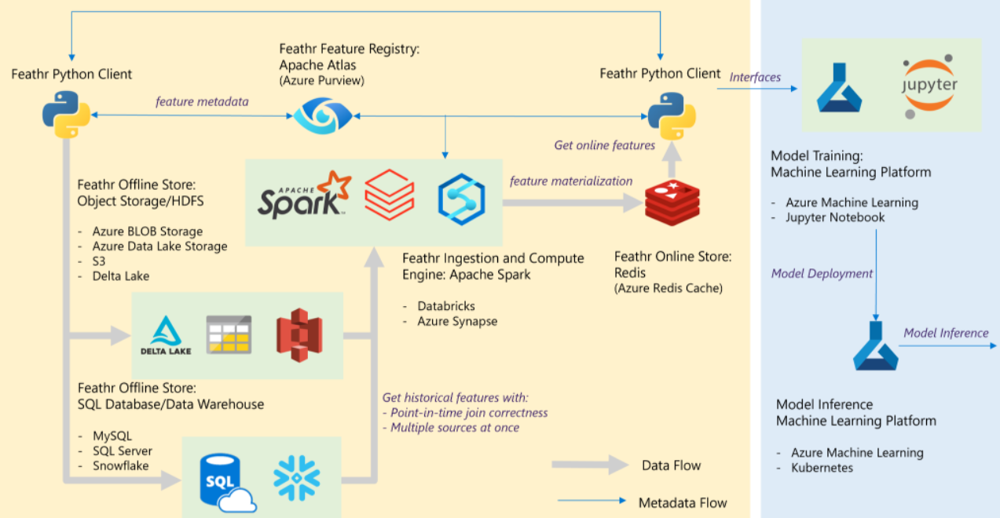

# Using Feathr in an Azure Machine Learning Environment
Feathr is the feature store that is used in production in LinkedIn for many years and was open sourced in April 2022. 

Read the announcement on [Open Sourcing Feathr](https://engineering.linkedin.com/blog/2022/open-sourcing-feathr---linkedin-s-feature-store-for-productive-m) and [Feathr on Azure](https://azure.microsoft.com/en-us/blog/feathr-linkedin-s-feature-store-is-now-available-on-azure/).

In this repo we use the official [Feathr repo](https://github.com/linkedin/feathr) to demonstrate the use of Feathr in an integrated Azure Machine Learning Environment. We will use some different sample datasets to practice the concepts as well. Feel free to contribute with us 😉.

We use the same high-level architecture proposed  on [Feathr documentation](https://linkedin.github.io/feathr/)



## Getting Started

You can use the same Quick Start from [Feathr](https://github.com/linkedin/feathr/blob/main/README.md#running-feathr-on-azure-with-3-simple-steps) to deploy the resources in your own Azure's subscription.

- Open your Azure ML environment and create a Computer Instance. The easiest way is to use the own [UI to create it](https://docs.microsoft.com/en-us/azure/machine-learning/how-to-create-manage-compute-instance?tabs=azure-studio#create).


- Next, open the terminal (or a notebook) and install Feathr client on the created compute instance

```python
pip install -U feathr
```

After restarting the Azure ML Kernel, you should be able to import Feathr:

```python
from feathr import FeathrClient
```

## Running Feathr on Azure ML

Check our sample [notebook](./Notebooks/Using%20Feathr%20with%20Azure%20Machine%20Learning%20and%20Databricks.ipynb) that demonstrate how to use Azure ML to train the model and Azure Databricks as the spark engine. In the end we'll have a realtime inference endpoint deployed ... 😍
